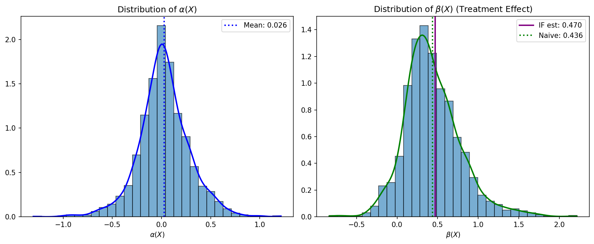
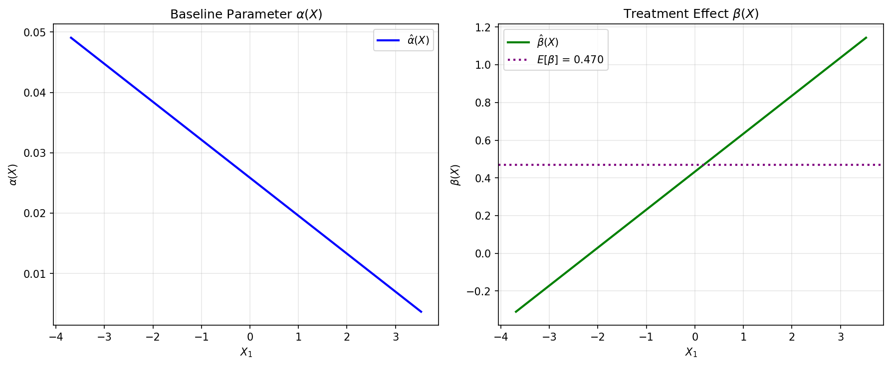

# deep-inference

```{raw} html
<p class="hero-tagline">
Deep Learning for Individual Heterogeneity with Valid Inference
</p>
```

`deep-inference` enriches structural economic models with deep learning while maintaining valid statistical inference. It implements the Farrell, Liang, and Misra (2021, 2025) framework.

```{raw} html
<div class="feature-grid">
  <div class="feature-card">
    <h3>Valid Inference</h3>
    <p>95% confidence intervals that actually cover 95% of the time</p>
  </div>
  <div class="feature-card">
    <h3>13 Model Families</h3>
    <p>Linear, Logit, Poisson, Gamma, NegBin, Weibull, Gumbel, Tobit, Gaussian, Probit, Beta, ZIP, Multinomial Logit</p>
  </div>
  <div class="feature-card">
    <h3>Economic Targets</h3>
    <p>AME, Elasticity, WTP, Consumer Welfare, and custom targets with autodiff</p>
  </div>
  <div class="feature-card">
    <h3>Regime Detection</h3>
    <p>Auto-selects optimal Lambda strategy for RCTs vs observational data</p>
  </div>
  <div class="feature-card">
    <h3>PyTorch Backend</h3>
    <p>Automatic differentiation for exact gradients and Hessians</p>
  </div>
</div>
```

## Quick Start

```python
import numpy as np
import torch
from deep_inference import structural_dml

# Heterogeneous logistic demand (binary outcomes)
np.random.seed(42)
torch.manual_seed(42)
n = 2000
X = np.random.randn(n, 5)
T = np.random.randn(n)

# Heterogeneous treatment effect: β(X) = 0.5 + 0.3*X₁
alpha = 0.2 * X[:, 0]
beta = 0.5 + 0.3 * X[:, 1]
prob = 1 / (1 + np.exp(-(alpha + beta * T)))
Y = np.random.binomial(1, prob).astype(float)

# Run influence function inference
result = structural_dml(
    Y=Y, T=T, X=X,
    family='logit',
    hidden_dims=[64, 32],
    epochs=100,
    n_folds=50
)

print(result.summary())
```

**Output** (Date/Time will vary):
```
==============================================================================
                            Structural DML Results
==============================================================================
Family:           Logit                Target:           E[beta]
No. Observations: 2000                 No. Folds:        50
Date:             Fri, 16 Jan 2026     Time:             13:54:12
==============================================================================
                  coef     std err         z     P>|z|      [0.025    0.975]
------------------------------------------------------------------------------
     E[beta]    0.4704      0.0496     9.492  0.000      0.3733    0.5675
==============================================================================
Diagnostics:
  Min Lambda eigenvalue:    0.134946
  Mean condition number:    1.17
  Correction ratio:         45.2493
  Pct regularized:          0.0%
------------------------------------------------------------------------------
```

### Predictions & Visualization

```python
# Predict treatment effects for new observations
X_new = np.random.randn(5, 5)
beta_new = result.predict_beta(X_new)
print(f"Predicted β(X) for new data: {beta_new}")

# Predict probabilities at treatment level T=1
proba = result.predict_proba(X_new, t_value=1.0)
print(f"P(Y=1|X,T=1): {proba}")

# Visualize heterogeneity distributions
result.plot_distributions()
result.plot_heterogeneity(feature_idx=1)  # β(X) vs X₁
```

**Distribution of estimated parameters:**



**Treatment effect heterogeneity (β vs X₁):**



## Economic Targets

The `inference()` API supports built-in economic targets:

```python
from deep_inference import inference

# Built-in: average marginal effect
result = inference(Y, T, X, model='logit', target='ame', t_tilde=0.0)
print(result.summary())
```

The same target can be defined from scratch with a custom loss and custom target — autodiff handles all derivatives:

```python
import torch

# Custom loss (logit negative log-likelihood)
def my_loss(y, t, theta):
    p = torch.sigmoid(theta[0] + theta[1] * t)
    return -y * torch.log(p + 1e-7) - (1 - y) * torch.log(1 - p + 1e-7)

# Custom target (average marginal effect at t_tilde)
def my_ame(x, theta, t_tilde):
    p = torch.sigmoid(theta[0] + theta[1] * t_tilde)
    return p * (1 - p) * theta[1]

result = inference(Y, T, X, loss=my_loss, target_fn=my_ame, theta_dim=2, t_tilde=0.0)
```

**Built-in output** (Date/Time will vary):
```
==============================================================================
                         Structural Inference Results
==============================================================================
Family:           Logit                Target:           ame
No. Observations: 2000                 No. Folds:        50
Date:             Sat, 07 Feb 2026     Time:             23:37:29
==============================================================================
                  coef     std err         z     P>|z|      [0.025    0.975]
------------------------------------------------------------------------------
         ame    0.1181      0.0127     9.290  0.000      0.0932    0.1431
==============================================================================
Diagnostics:
------------------------------------------------------------------------------
```

**Custom output**:
```
==============================================================================
                         Structural Inference Results
==============================================================================
No. Observations: 2000                 Target:           E[beta]
Date:             Sat, 07 Feb 2026     No. Folds:        50
                                       Time:             23:41:09
==============================================================================
                  coef     std err         z     P>|z|      [0.025    0.975]
------------------------------------------------------------------------------
     E[beta]    0.1251      0.0128     9.763  0.000      0.1000    0.1502
==============================================================================
Diagnostics:
------------------------------------------------------------------------------
```

> Both approaches produce matching estimates (0.118 vs 0.125, within MC noise). Output generated by [`docs/generate_quickstart_plots.py`](https://github.com/rawatpranjal/deep-inference/blob/main/docs/generate_quickstart_plots.py).

More built-in targets:

```python
# Price elasticity at P=2.0
result = inference(Y, T, X, model='logit', target='elasticity', t_tilde=2.0)

# Consumer welfare
result = inference(Y, T, X, model='logit', target='welfare', t_tilde=2.0)

# Randomized experiment (compute Lambda instead of estimating)
from deep_inference.lambda_.compute import Normal
result = inference(Y, T, X, model='logit', target='beta',
                   is_randomized=True, treatment_dist=Normal(0, 1))
```

## Why deep-inference?

**The Problem**: Neural networks are great at prediction but naive inference produces invalid confidence intervals with coverage far below 95%.

**The Solution**: Influence function-based debiasing corrects for regularization bias, providing valid confidence intervals for economic targets like average treatment effects.

| Method | Coverage | SE Ratio |
|--------|----------|----------|
| Naive | 8% | 0.27 |
| **Influence** | **95%** | **1.08** |

## Documentation

```{toctree}
:maxdepth: 2
:caption: Contents

getting_started/index
flowchart
tutorials/index
theory/index
algorithm/index
validation/index
api/index
```

## References

- Farrell, Liang, Misra (2021): "Deep Neural Networks for Estimation and Inference" *Econometrica*
- Farrell, Liang, Misra (2025): "Deep Learning for Individual Heterogeneity" *Working Paper*
- Dubé, Misra (2023): "Personalized Pricing and Consumer Welfare" *Journal of Political Economy*
- Colangelo, Lee (2026): "Double Debiased Machine Learning for Treatment Effects" *Working Paper*
- Hetzenecker, Osterhaus (2024): "Deep Learning for Heterogeneous Parameters in Discrete Choice Models" *arXiv 2408.09560*
- Momin (2025): "Heterogeneous Treatment Effects Using Deep Neural Networks" *SSRN 5149650*
- Chen, Liu, Ma, Zhang (2024): "Causal Inference of General Treatment Effects using Neural Networks" *Journal of Econometrics*
- Chernozhukov, Newey, Quintas-Martinez, Syrgkanis (2022): "RieszNet and ForestRiesz: Automatic Debiased Machine Learning with Neural Nets" *ICML 2022*

## License

MIT License
